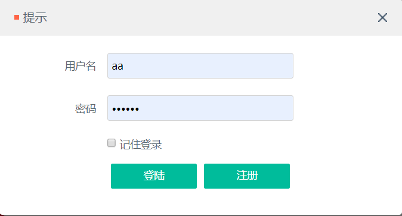
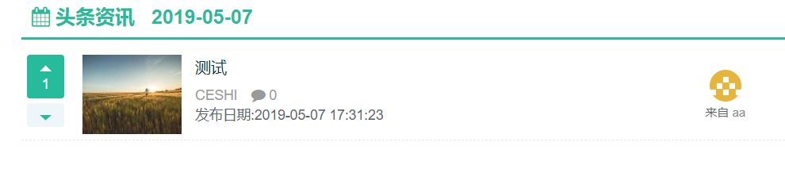
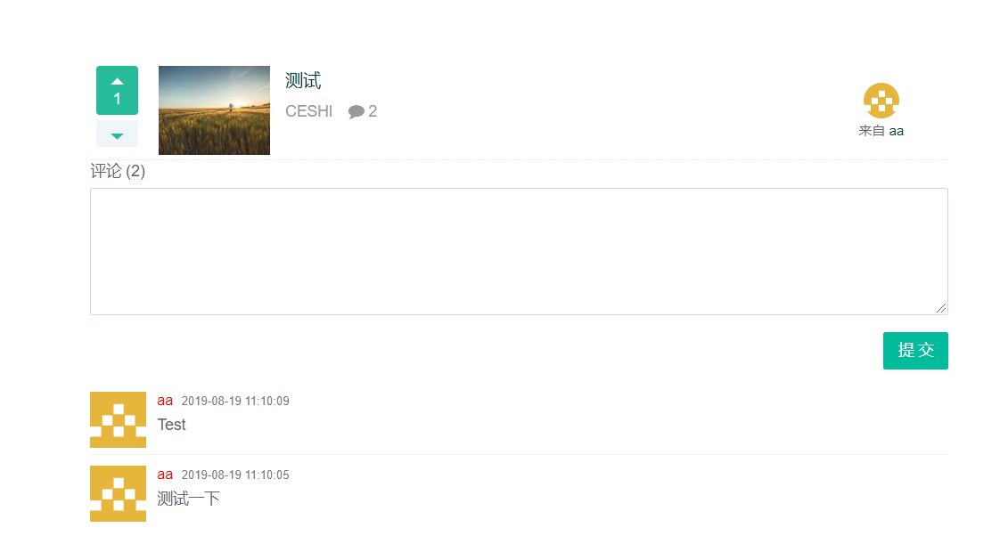

# 资讯分享平台

- [介绍](#介绍)
- [快速启动](#快速启动)
- [系统架构](#系统架构)
- [模块介绍](#模块介绍)
- [Q&A](#Q&A)
- [TODO LIST](#TODO)
- [参考](#参考)

## 介绍

本项目为资讯分享平台

## 快速启动

- 构建工具

  apache-maven-3.6.1

- 开发环境

  JDK 1.8、Mysql 5.7、SpringBoot 1.3.5.RELEASE、redis 5.0.3

在安装之前，需要安装好上述构建工具和开发环境，推荐在linux下安装上述开发环境。

**第一步**；完成数据库的初始化，使用~初始化数据库。

**第二步**；访问项目入口地址

<http://localhost:7777/>

初始用户名：aa，密码：123456

- 缓存采用redis；
- 消息队列采用redis实现；

## 模块介绍
- 登录模块
- 图片上传模块
- 点赞模块
- 异步队列模块

### 登录

### 图片上传，分享资讯
登陆以后，点击右上角分享。

之后选择图片，输入标题，选择链接，点击提交即可。
### 点赞点踩
查看资讯

如果当前登录的用户对一条资讯点过赞或者点过踩，那么这条资讯的点赞或者点踩按钮就会处于高亮状态。
### 评论

对于一条资讯，用户可以点击进入这条咨询的详情页，在详情页可以查看到该条信息的详情以及所有评论内容

## TODO
- 排行榜
- 关注列表
