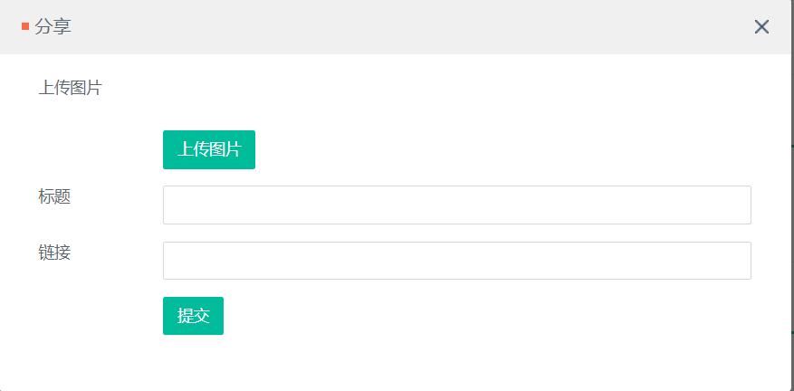

# 资讯分享平台

- [介绍](#介绍)
- [快速启动](#快速启动)
- [系统架构](#系统架构)
- [模块介绍](#模块介绍)
- [Q&A](#Q&A)
- [TODO LIST](#TODO)
- [参考](#参考)

## 介绍

本项目为资讯分享平台


## 快速启动

- 构建工具

  apache-maven-3.6.1

- 开发环境

  JDK 1.8、Mysql 5.7、SpringBoot 1.3.5.RELEASE、redis 5.0.3

在安装之前，需要安装好上述构建工具和开发环境，推荐在linux下安装上述开发环境。

**第一步**；完成数据库的初始化，使用~初始化数据库。

**第二步**；访问项目入口地址

<http://localhost:7777/>

初始用户名：aa，密码：123456


- 缓存采用redis；
- 消息队列采用redis实现；

## 模块介绍
- 登录模块
- 图片上传模块
- 点赞模块
- 异步队列模块

### 登录


### 图片上传，分享资讯
登陆以后，点击右上角分享。




之后选择图片，输入标题，选择链接，点击提交即可。
### 点赞点踩
查看资讯


如果当前登录的用户对一条资讯点过赞或者点过踩，那么这条资讯的点赞或者点踩按钮就会处于高亮状态。
### 评论


对于一条资讯，用户可以点击进入这条咨询的详情页，在详情页可以查看到该条信息的详情以及所有评论内容

### 系统通知

如果一个人注册成功，系统会给他站内信发一条消息"欢迎来到头条资讯"。
如果有别的用户给你一个用户的资讯点了赞或者评论了，系统也会给被点赞或者是被评论用户发一条消息"某某某点赞了你的资讯xxx""某某某评论了你的资讯xxx"

### 异步队列
**此处借用点赞的逻辑来往下追踪异步队列的实现方式**
```java
    @RequestMapping(path = {"/like"}, method = {RequestMethod.GET, RequestMethod.POST})
    @ResponseBody
    public String like(@RequestParam("newsId") int newsId) {
        User user=hostHolder.getUser();
        if(user==null){
            return "请先登录！";
        }
        int userId = hostHolder.getUser().getId();
        if(likeService.getLikeStatus(userId,EntityType.ENTITY_NEWS,newsId)==1){
            likeService.cancelLike(userId,EntityType.ENTITY_NEWS,newsId);
            long getlikecount=likeService.getNumberoflike(EntityType.ENTITY_NEWS,newsId);
            //logger.info("点赞取消了");
            newsService.updateLikeCount(newsId, (int) getlikecount);
            return ToutiaoUtil.getJSONString(0,String.valueOf(getlikecount));
        }else {
            long likecount = likeService.like(userId, EntityType.ENTITY_NEWS, newsId);
            News news = newsService.getById(newsId);
            newsService.updateLikeCount(newsId, (int) likecount);
            //生产者发送事件
            eventProducer.fireEvent(new EventModel(EventType.Like)
                    .setActorId(hostHolder.getUser().getId()).setEntityId(newsId)
                    .setEntityType(EntityType.ENTITY_NEWS).setEntityOwnerId(news.getUserId()));
            //logger.info("又点赞了");
            return ToutiaoUtil.getJSONString(0, String.valueOf(likecount));
        }
    }
```
EventProducer的firEvent方法
```java
public boolean fireEvent(EventModel model){
        String json = JSONObject.toJSONString(model);
        String key = RedisKeyUtil.getEventQueueKey();
        jedisAdapter.lpush(key,json);
        return true;
    }
```
**此处可以看出，fireEvent方法实际上是把model对象序列化之后放到redis中的一个list中**
事件模型
```java
public class EventModel {
    private EventType type; //类型
    private int actorId; //操作者
    private int entityType; //资讯类型
    private int entityId; //资讯id
    private int entityOwnerId; //资讯发布人id
    //省略构造方法以及get/set方法
    }
```
其中的EventType是枚举类型
**此时生产者已经生产出了一个model并且放入redis的队列中，那是怎么根据这个model创建出一条站内信，也就是写数据库呢**
```java
@Service
public class EventConsumer implements InitializingBean, ApplicationContextAware {
    private static final Logger logger= LoggerFactory.getLogger(EventConsumer.class);
    private Map<EventType, List<EventHandler>> config=new HashMap<EventType, List<EventHandler>>();
    private ApplicationContext applicationContext;
    @Autowired
    JedisAdapter jedisAdapter;

    @Override
    public void afterPropertiesSet() throws Exception {
        Map<String, EventHandler> beans = applicationContext.getBeansOfType(EventHandler.class);
        if (beans != null) {
            for (Map.Entry<String, EventHandler> entry : beans.entrySet()) {
                List<EventType> eventTypes = entry.getValue().getSupportEventType();
                for (EventType type : eventTypes) {
                    if (!config.containsKey(type)) {
                        config.put(type, new ArrayList<EventHandler>());
                    }
                    config.get(type).add(entry.getValue());
                }
            }
        }
        ExecutorService executorService = Executors.newCachedThreadPool();
        executorService.execute(() ->{
            while(true){
                String key= RedisKeyUtil.getEventQueueKey();
                // brpop 和 pop 区别 要用阻塞pop
                //brpop返回的为什么是List<>类型？
                //此处是返回一个含有两个元素的列表，第一个元素是被弹出元素所属的key，第二个元素是被弹出元素的值。
                List<String> events = jedisAdapter.brpop(0,key);
                for(String message:events){
                    if(message.equals(key)) {
                        continue;
                    }
                    EventModel eventModel= JSON.parseObject(message,EventModel.class);
                    if(!config.containsKey(eventModel.getType())){
                        logger.error("不能处理的事件" );
                        continue;
                    }
                    for(EventHandler handler:config.get(eventModel.getType())){
                        handler.doHandle(eventModel);
                    }
                }
            }
        });
        @Override
        public void setApplicationContext(ApplicationContext applicationContext) throws BeansException {
            this.applicationContext=applicationContext;
        }
}
```
EventConsumer类实现了InitializingBean, ApplicationContextAware两个接口，实现了前者是为了afterPropertiesSet()方法，凡是继承该接口的类，在bean的属性初始化后都会执行该方法，而后者是为了获取应用程序上下文。在afterPropertiesSet()方法的开始中，有一个hashmap是用来记录所有的Event处理器，
```
 也就是
 Map<String, EventHandler> beans = applicationContext.getBeansOfType(EventHandler.class);
```
在此处，EventHandler是一个接口，这句代码的意思是要找出所有的EventHandler的实现类，
```
public interface EventHandler {
    void doHandle(EventModel model);//每个handler对事情的处理不一样 抽象为接口
    List<EventType> getSupportEventType();//关注哪些EventType 只要发生了这些EventType都要处理
}
```

对于一个类型，找出需要处理的所有处理器，也就是一个Map<EventType,List<EventHandler>的方式来记录下所有的type与handler的对应关系，虽然此处为一一对应，没有一个type对应多个handler的情况，但是如果业务更加复杂，就需要用List来记录所有handler，记录完之后，用线程池的方式来消费队列中的模型，注意从队列中拿出的方式应该是brpop，此时把拿出来的序列化之后的值反序列化成java对象事件模型model，然后去config这个hashmap中找到model的type对应的处理器handler，然后就可以交给处理器执行dohandle方法了，而dohandle方法就是根据model的各种属性往消息表里写一条语句，也就是发送一条站内信。至此消费者功能已经基本完成

## TODO
- 排行榜
- 关注列表
- 多级评论
